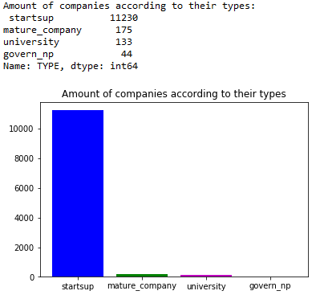

<h1 align="center"> dealroom.co  </h1>
<h1 align="center"> .....Technical Assingment..... </h1>

## PART-1

- Firstly, I tried to understand the data/file via some methods in the commented area.
- Then, I read the data and created a dataframe.
- I created keyword lists. I chose them from the data, to categorize companies.
- Companies should be divided into five categories, adhering to the given definitions. So I created five company columns in my dataframe.
- The goal of this task is to classify each entity into the following types:

| Type  | Definition   |
|:---|:---|
|Startups   | Companies founded after 1990, that are innovative and tech-orientated  |
|Mature companies   |Established companies, founded before 1990   |
| Universities/Schools  |  Universities and schools  |
| Government/Non-profit  |  Governmental organisation and non-profit companies  |
| Unclassified  |   |

- I created function for columns' condotions :
   1. The first function - 'find_edu': While this function is navigating in the "edu_list" I have prepared, it checks whether the words in this list are in the "NAME" column. I used this function to create the 'university' column with the 'apply' function defined in library of pandas.
   2. The second function - 'find_gnp': While this function is navigating in the "gnp_list" I have prepared, it checks whether the words in this list are in "NAME", "TAGLINE" and "TAGS" columns. I also used "df.WEBSITE.str.contains(".gov")" for looking to goverments' website. I used this function to create the "govern_np" column with the 'apply' function defined in library of pandas. 
   3. The third function - 'select_year': This function is also to find Startups and Mature companies. It is for time condition. The function finds first for element of companies' date.

- I modified the "TYPE" column with the columns I added.I used idxmax(axis=1) for inserting correct index. That is, I took the row of information in the columns I added and placed it on the row in the "TYPE" column.
- I dropped the columns I added to keep the original version of the excel file.
- For the "Count" sheet, I calculated the amount of each company type in the "TYPE" column with "value_counts".
- I printed on "Data" and "Count" sheets with "with pd.ExcelWriter" and "to_excel".
- Finally, I used matplotlib library to show the amounts of the companies according to the types of them.

## PART-2

## Install 

git clone https://github.com/aysegulcayir/DR_TA.git

## Author

Aysegul Cayir Aydar

Data Scientist&Python Developer